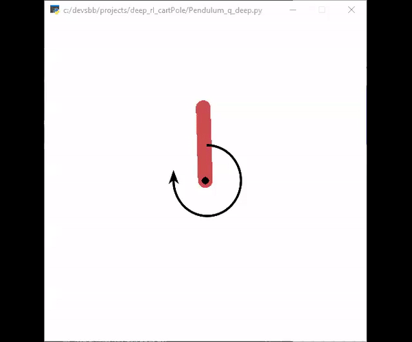

This repository is about solving the two reinforcement learning challenges [**cartPole**](https://gym.openai.com/envs/CartPole-v0/)  and [**Pendulum**](https://gym.openai.com/envs/Pendulum-v0/) of the openai gym. 

The goal was to find solutions quickly and with as simple as possible learning algorithms. 

# Algorithms
## Deep Q-learning
## Naive Q-learing
## Random actor (to compare with)

# Results
The controller for the more difficult of the two problems, the pendulum, achieves a fast and stable upward swing. The trained network is available in [q.json](pendulum/src/q.json) with weights in [q.h5](pendulum/src/q.h5)

